
<h1 align="center">论文投稿系统+vue</h1>

## 简介
论文投稿系统：功能包括用户注册、论文提交与管理、交流论坛、初稿和终稿管理、输入与编辑、文件上传、用户与角色管理。整体设计简洁，操作便捷，适合学术论文提交与管理。    --计算机毕业设计源码；毕设源码；java毕业设计源码

## 联系方式

<h3 align="center">获取完整代码与数据库文件 + 微信：deepguan QQ: 86050149 QQ群: 783742310</h3>

<h3 align="center">可帮忙远程部署 包运行成功！提供远程部署、修改代码、设计文档指导、代码讲解等服务！</h3>

## 功能介绍（完整见运行截图）
管理员：基本功能包括用户管理、初稿管理、终稿管理、英文材料管理，并可在系统内查看和管理稿件列表，审核、修改或删除稿件，以及上传译稿等功能。管理员还可以管理交流论坛发表信息并查看用户互动，维护系统的各个模块，确保顺畅运行。此外，轮播图管理功能允许管理员上传图片并新增或修改名称，以便于系统界面展示优化。用户信息以及论文的详细信息均可查看，管理员能够快速返回上一页面进行操作。

用户：进入系统后可进行注册登录操作，并通过个人中心查看和修改个人信息。用户的主要功能是提交论文，包括输入论文的基本信息如标题、编号和摘要内容，并上传相关电子文档。系统允许用户查看和管理自己的投稿状态以及审稿结果，以便于及时获取系统反馈。此外，用户可以参与交流论坛，查看帖子、评论讨论，并发起新的交流话题，为学术交流提供便利。界面设计简洁易于操作，用户体验良好。

投稿人：在登录系统后，可通过导航功能进入初稿管理和最终稿管理模块，依据需求上传和编辑稿件，使用富文本编辑器修饰排版，包括图片或链接插入，调整文本格式。投稿人能实时查看自己的稿件状态，如审核中、审核通过或退回修改等信息，便于实时掌握进展并迅速作出调整。通过系统的简洁界面和清晰功能指引，投稿人能够高效完成由初稿至最终稿的完整流程。

审核人：审核人通过系统左侧功能菜单进入稿件管理模块，能够查看包括用户名、论文标题、提交时间等详细的稿件信息。审核人应根据文章内容对其进行评审，选择审核通过、退回修改或删除稿件等操作，还可对投稿人的内容提供具体意见和建议。同时，系统中提供的搜索功能可帮助审核人快速定位到特定稿件，确保审核工作高效运行。审核界面设计注重清晰便捷，提升审核效率。

## 运行截图
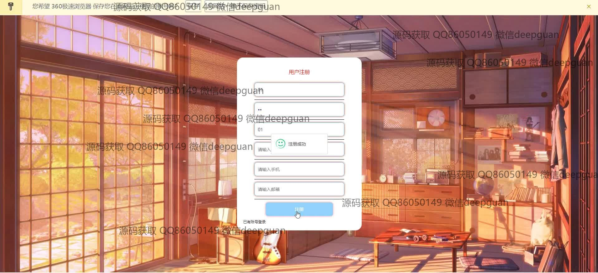
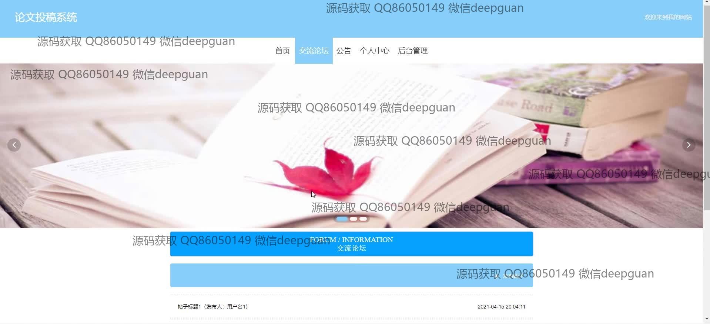
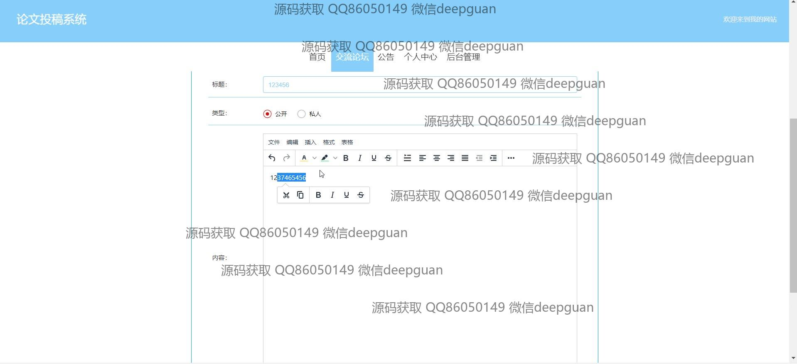
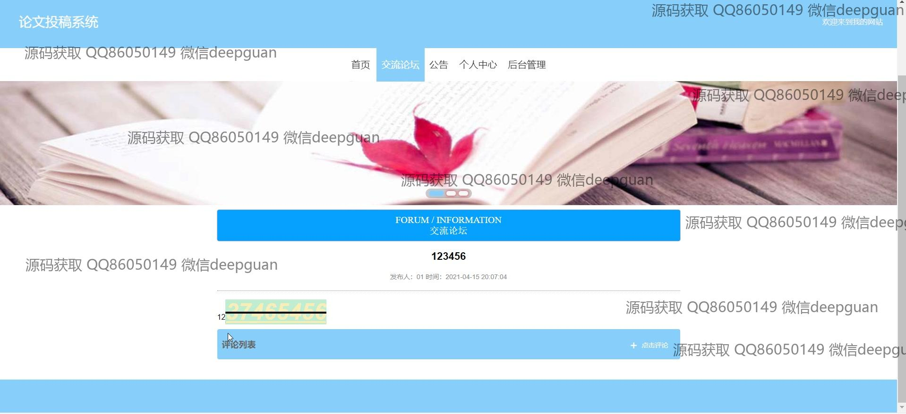
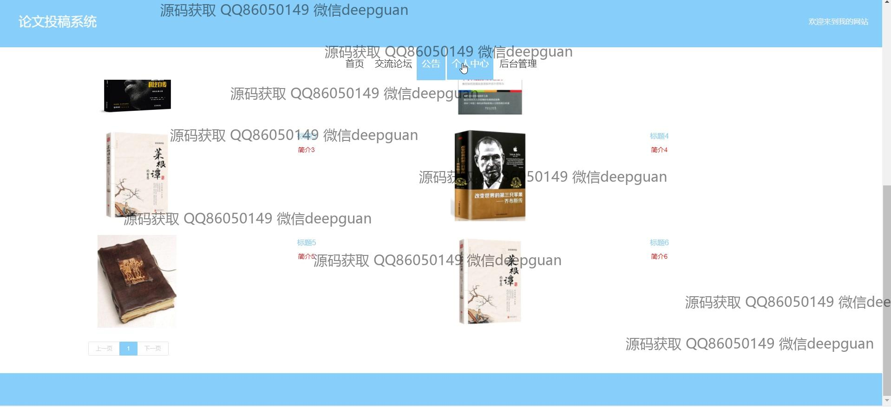
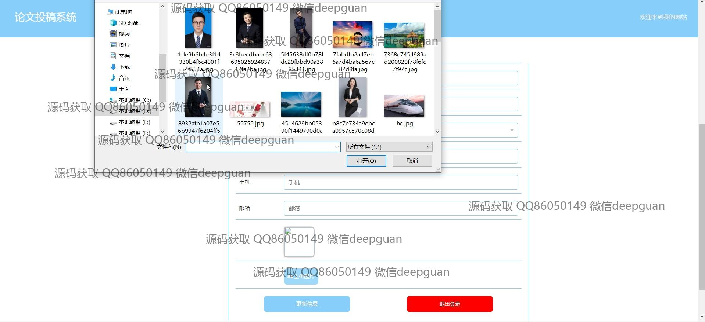
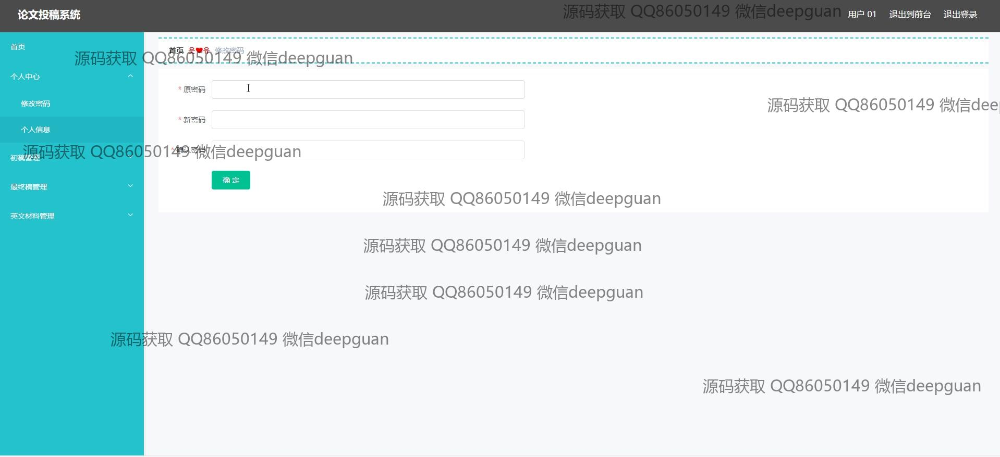
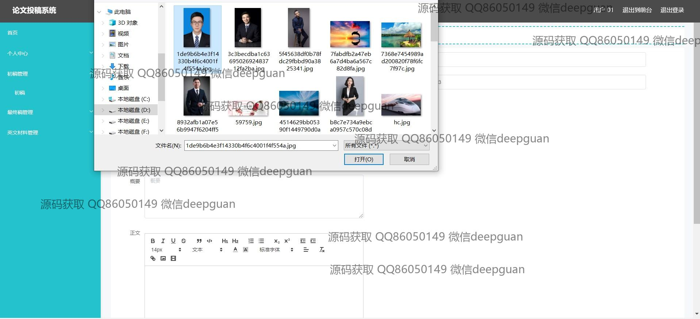
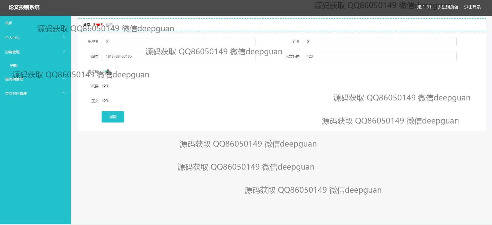
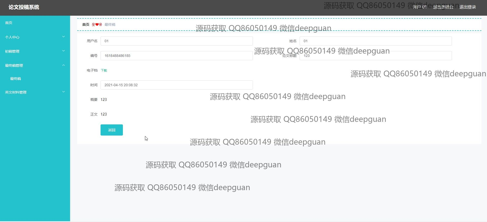
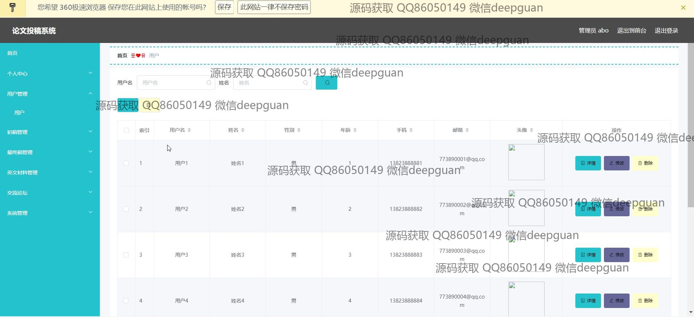
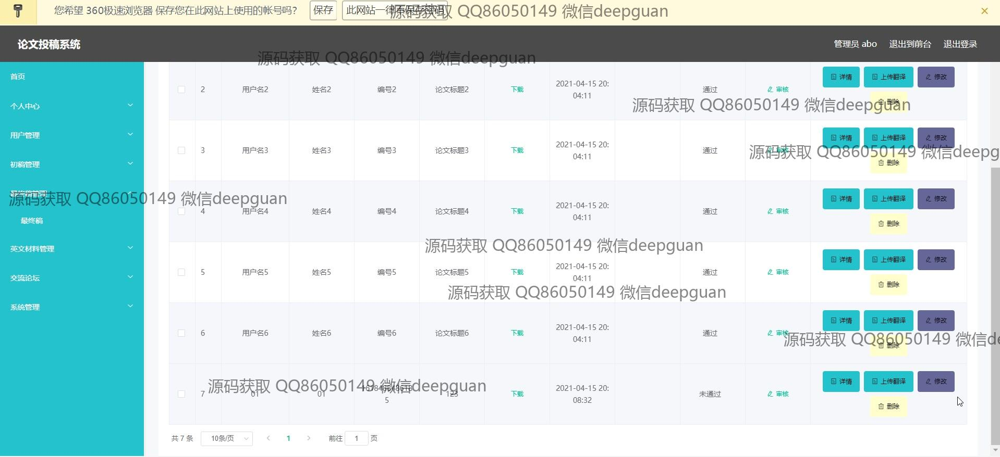
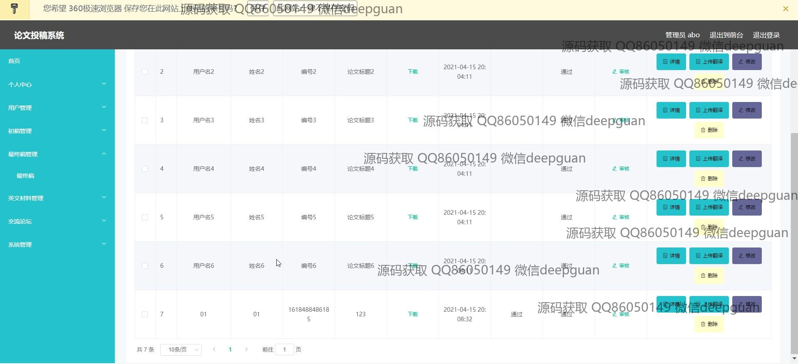
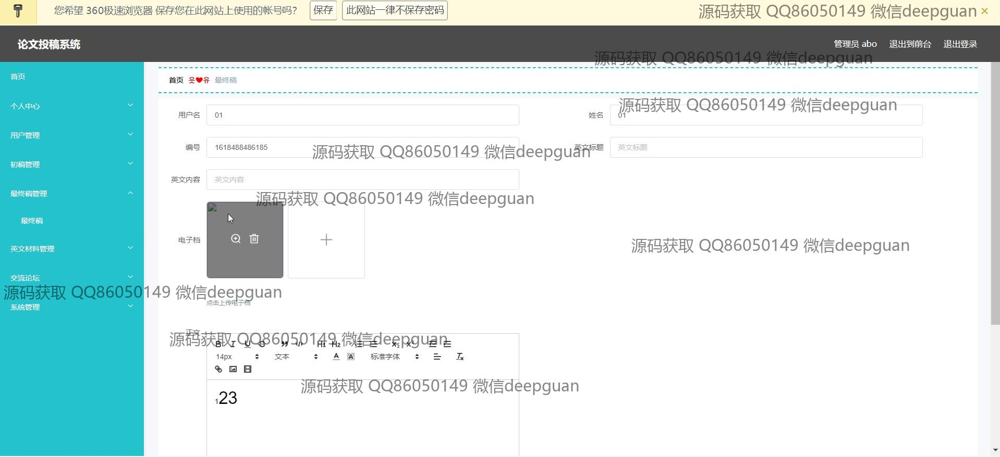
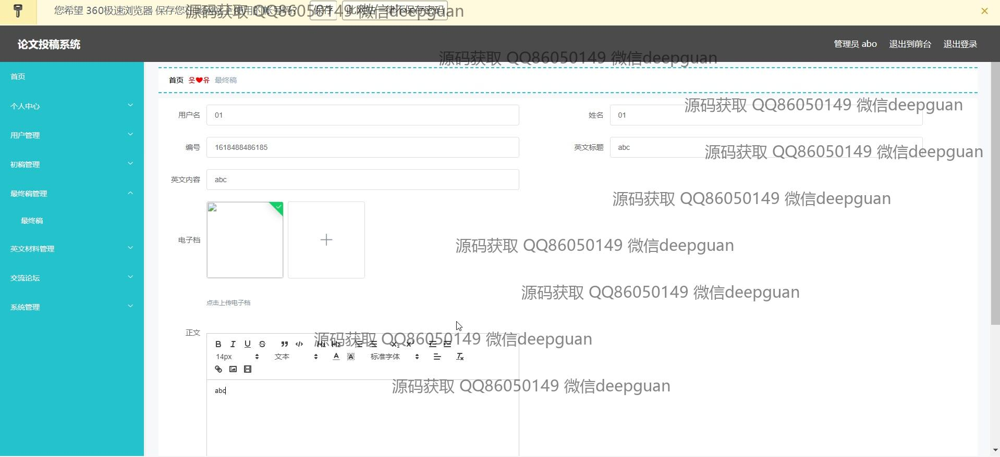
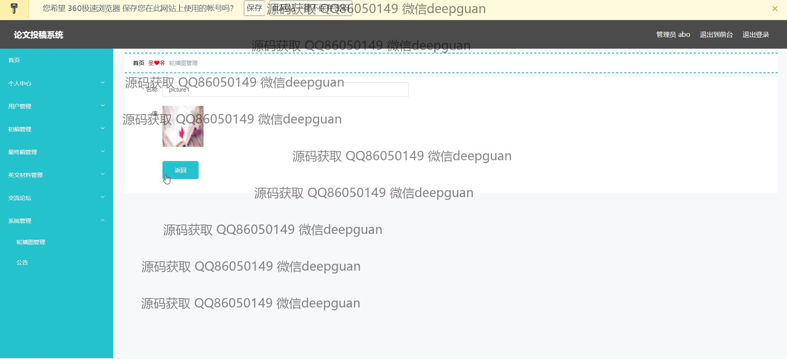
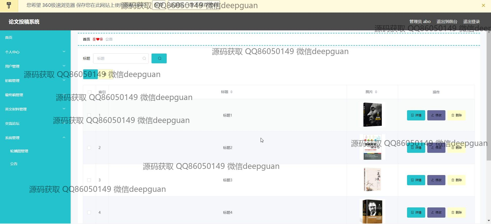
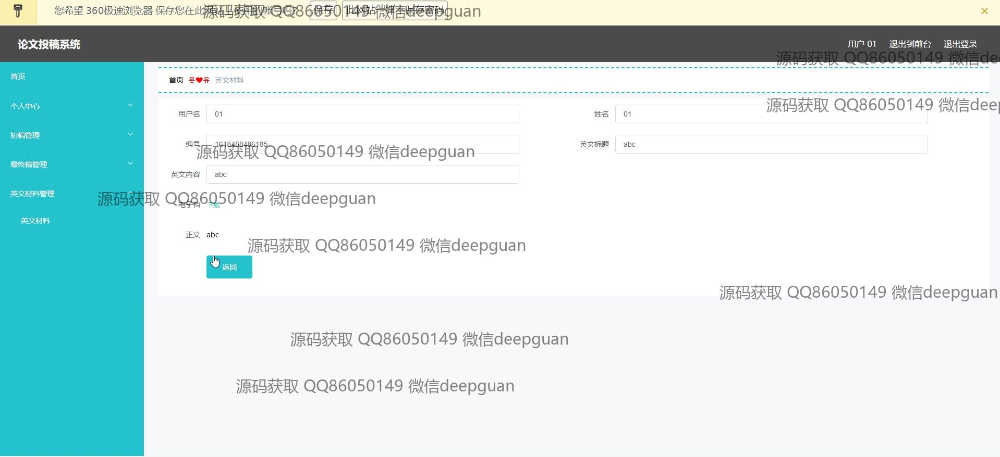

本代码来源于网络,仅供学习参考使用!

